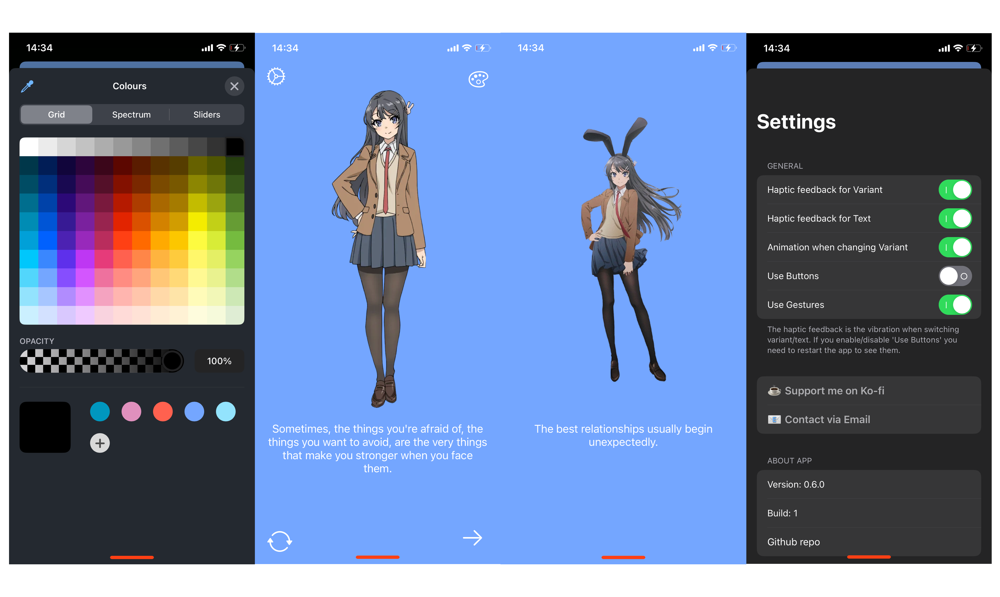

# myWaifu2D
simple swift app that display an anime girl + some texts under it. Thanks chatgpt

## UI:

Remember that the UI may change during time ( already changed [ too lazy to change all the times lol ] )

---
## USAGE:

#### IMPORTANT: IF YOU DISABLE BOTH "USE BUTTONS" AND "USE GESTURES" YOU DONT NEED TO RE-INSTALL THE APP. JUST TOUCH QUICKLY 3 TIMES ON THE SCREEN AND THE SETTINGS PAGE WILL POP UP

GESTURES:

- swipe Left = Variant change (for left i mean that you need to start from right and go left)
- swipe right = Text changed (for right i mean that you need to start from left and go right)
- swipe up = Colour picker (start down go up)
- swipe down = Settings (start up go down)

---

## INSTALLATION:

To install the app, you need to get the .ipa file from the Release page ( latest build is recommended) and then use trollstore, sideloadly, altstore or any other program to install .ipa files.

---
## Things to add:

- custom display image/images
- custom display text
- ~~a menu to manage some stuffs (kinda done have to make it works)~~
- ~~widget with a display image~~

---

